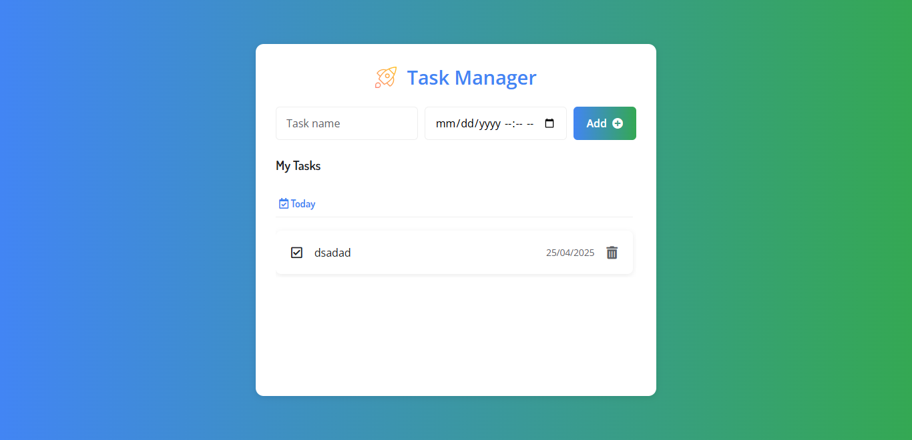
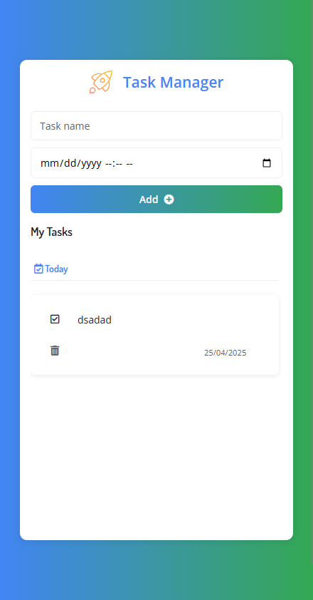

# 📝 Todo App

A modern task management application built with vanilla JavaScript that allows users to create,
organize, and track daily tasks with dates.


[](https://td-app.devprojects.tech)
[](https://td-app.devprojects.tech)

<p align="center">
  
</p>

## ✨ Features

### Core Functionality

-   ➕ Add tasks with dates and times
-   ✅ Mark tasks as complete with visual feedback
-   🗑️ Delete tasks with confirmation
-   📅 Organize tasks chronologically by date
-   💾 Local storage persistence
-   📱 Fully responsive design for all devices

### New in v1.1.0

-   🌐 **Progressive Web App (PWA)** - Install on home screen and use offline
-   🔔 **Visual Feedback** - Notifications when tasks are added, completed, or deleted
-   ♿ **Accessibility Improvements** - Screen reader support and keyboard navigation
-   🖼️ **Enhanced UI/UX** - Improved layouts for mobile and tablet devices
-   🔍 **SEO & Sharing** - Better metadata and social media preview images

## 🚀 Demo

Visit the live demo: [Todo App](https://td-app.devprojects.tech)

<div align="center">
  <table>
    <tr>
      <th>Desktop</th>
      <th>Mobile</th>
    </tr>
    <tr>
      <td></td>
      <td></td>
    </tr>
  </table>
</div>

## 🛠️ Technologies

<p align="center">
  
  
  
</p>

-   **Frontend**: HTML5, CSS3, JavaScript (ES6+)
-   **Libraries**:
    -   [Moment.js](https://momentjs.com/) - Date handling and formatting
    -   [UUID](https://github.com/uuidjs/uuid) - Unique ID generation
    -   [Font Awesome](https://fontawesome.com/) - Icons and visual elements
-   **PWA**: Service Worker for offline functionality

## 📦 Installation

1. Clone the repository

```bash
git clone https://github.com/sandovaldavid/TD_App.git
```

2. Navigate to project directory

```bash
cd TD_App
```

3. Open `index.html` in your browser or use a local server

## 💻 Usage

| Action        | Description                                                   |
| ------------- | ------------------------------------------------------------- |
| Add Task      | Enter task name and select date, then click "Add"             |
| Complete Task | Click the checkbox icon next to the task                      |
| Delete Task   | Click the trash icon to remove the task                       |
| Install App   | Click "Add to Home Screen" in your browser menu (PWA feature) |

## 🏗️ Project Structure

```
todo-app/
├── assets/           # Static assets and icons
│   ├── icons/        # PWA and favicon icons
│   └── og/           # Open Graph images for sharing
├── components/       # JavaScript components
├── services/         # Utility services
├── docs/             # Documentation and release notes
├── styles.css        # Main stylesheet
├── index.html        # Entry point
├── script.js         # Main JavaScript file
├── service-worker.js # PWA offline support
└── manifest.json     # PWA configuration
```

## 📝 Release Notes

-   [v1.2.0](https://github.com/sandovaldavid/TD_App/releases/tag/v1.2.0) - New footer Ui

-   [v1.1.0](https://github.com/sandovaldavid/TD_App/releases/tag/v1.1.0) - Current version with PWA
    support and UI improvements
-   [v1.0.0](https://github.com/sandovaldavid/TD_App/releases/tag/v1.0.0) - Initial release with
    core functionality

## 🤝 Contributing

Contributions are welcome! Please feel free to submit a Pull Request.

1. Fork the repository
2. Create your feature branch (`git checkout -b feature/AmazingFeature`)
3. Commit your changes (`git commit -m 'Add some AmazingFeature'`)
4. Push to the branch (`git push origin feature/AmazingFeature`)
5. Open a Pull Request

## 📄 License

This project is licensed under the MIT License - see the LICENSE file for details

---

## 🙏 Acknowledgments

-   [Moment.js](https://momentjs.com/) for simplifying date manipulation
-   [Font Awesome](https://fontawesome.com/) for the beautiful icons
-   [UUID](https://github.com/uuidjs/uuid) for unique ID generation

---

## 👨‍💻 Authors

### [David Sandoval](https://github.com/sandovaldavid)

-   🌐 Portafolio: [devsandoval.me](https://devsandoval.me)
-   💼 LinkedIn: [@devsandoval](https://linkedin.com/in/devsandoval)
-   💻 GitHub: [@sandovaldavid](https://github.com/sandovaldavid)
-   📧 Email: [contact@devsandoval.me](mailto:contact@devsandoval.me)

---

_⭐️ If you found this project helpful, please consider giving it a star!_

---

<p align="center">
Made by <a href="https://devsandoval.me/">@sandovaldavid</a>
</p>
